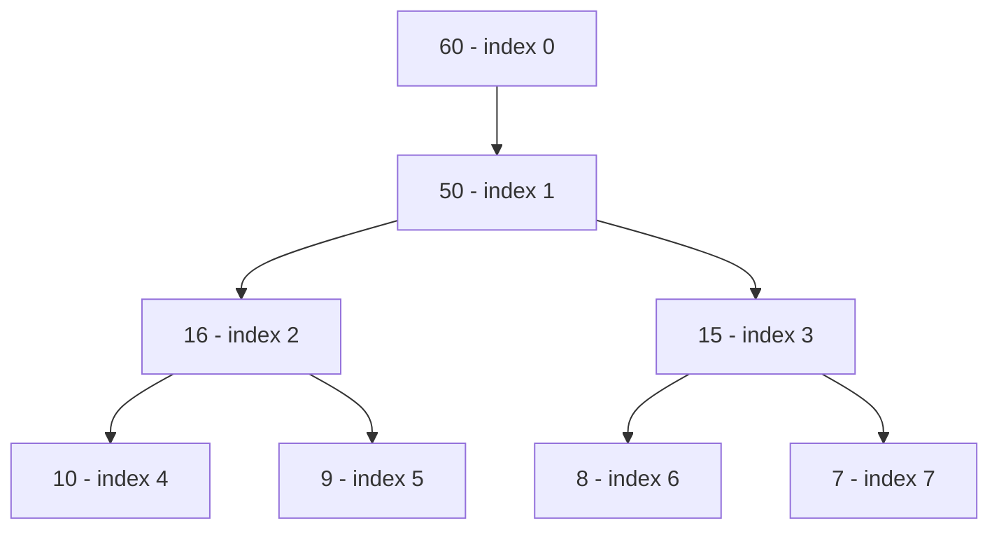
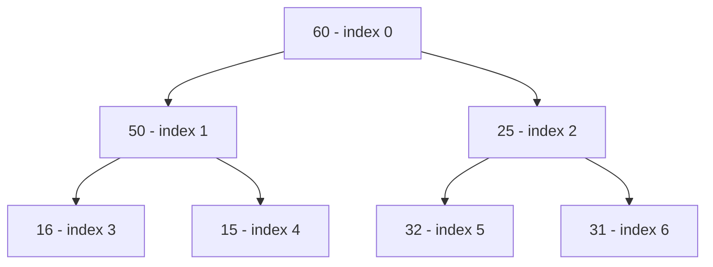
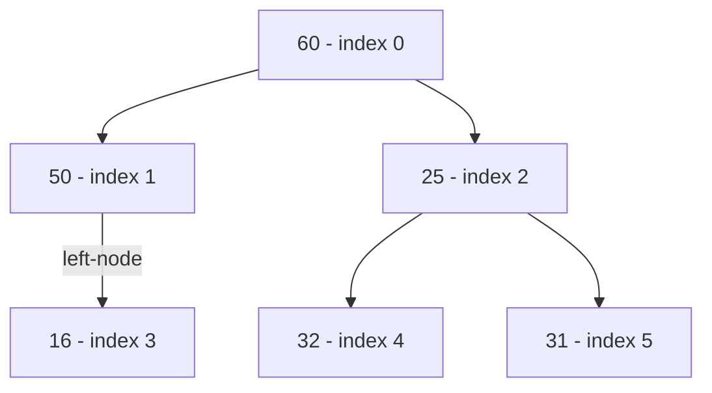
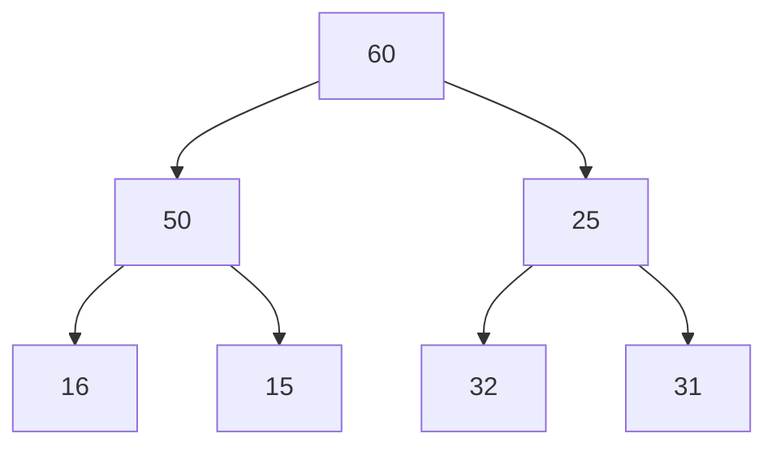
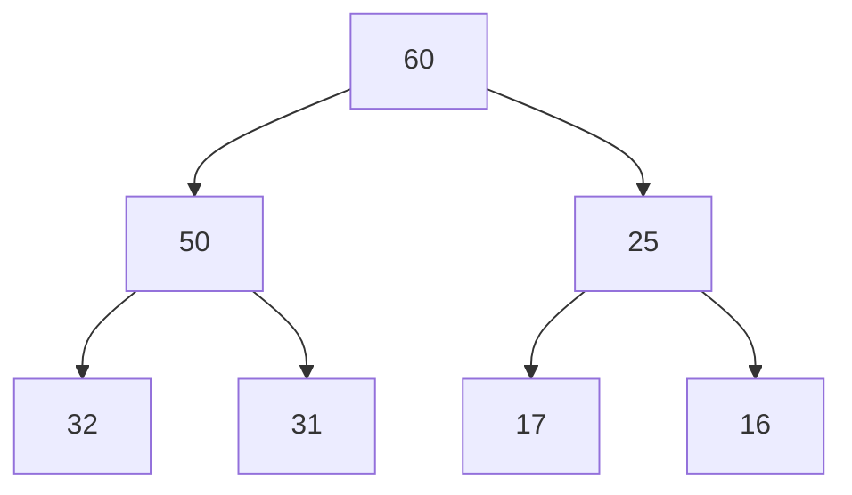
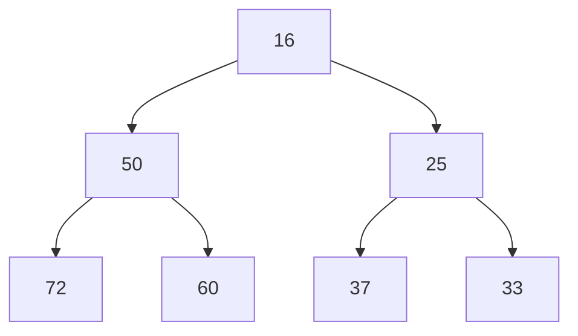

# Heap Sort
Heap Sort utilizes on Binary Tree, more special case of a Binary Tree called a Heap.
So, we have to take a short detour, towards Data Structures, to explain Binary Trees and their characteristics.

## Binary Tree
A **Binary Tree** is a type of tree data structure in which every node has at most two child nodes, a left node and a right node.

### Array Representation of Binary Tree
* Representing a Binary Tree as an array would go something like this,
  * We would start from the top the root node would be the first element of the array.
  * And, then we would go down one level, start from the left and go towards the right, the left-most element in the level would be the next element in the array.
  * If certain nodes do not have children then, leave a null value for them in the array representation.


An array representation of this tree would be, `[60, 50, 16, 15, 10, 9, 8, 7]`.


An array representation of this tree would be, `[60, 50, 25, 16, 15, 32, 31]`.



An array representation of this tree would be, `[60, 50, 25, 16, None, 32, 31]`.
???+ node
    I added disambiguation to denote the left node, as [mermaid-js](https://mermaid-js.github.io/mermaid/) automatically centers child nodes when only one exists.

Formally, this would mean:

* If a node is at index $x - i$, the left child of the node should be at index $2*i$ and the right child of the node should be at index $2*(i+1)$.
* For a particular node at index $i$ in the array representation its parent Node would be at $i/2$.

### Full Binary Tree
* A Binary Tree is **Full**, when all nodes except the leaf nodes have two child nodes.
* Alternative definition would be, a binary tree with maximum number of nodes is called a Full binary tree.
* The maximum number of nodes would be, $2^(h + 1) - 1$ where $h$ is the height of the binary tree.
* The below is an example.


### Complete Binary Tree also called a Heap
* A **Complete Binary Tree** is a Binary Tree which has no gaps when represented as an array, this is also referred to as a **Heap**.
* Heaps are also used a **Priority Queues**. 
* **Max Heap** is a Complete Binary Tree where all parent nodes are of greater value than or equal to the values of their child nodes, and the root node has the greatest value.

* **Min Heap** is a Complete Binary Tree where all parent nodes have values lesser than or equal to the values of their child nodes, so the root node has the least value.


### Inserting and Deleting Elements from a Heap
#### Insertion on a Max Heap
A new element is added at the left-most bottom node, that is the end of the array representation. 
Then, if the new node has  a value greater than its parent i.e. the binary tree is no longer a Max Heap, the binary tree is then reorganized by shuffling parent and child nodes until it transforms into a Max Heap again.
So, if the new node's value is greater than its immediate parent node, the new node is bubbled upwards in the binary tree until new node's parent has a greater value, it might even become the root node of the tree if its value is greater than all of its parents.

##### Time Complexity
Worst-case complexity of insertion on a Max Heap is $O(log n)$, happens when the new node has a value greater than all the nodes, as then the new node would have to be bubbled up to the root.
So then we would have to traverse the height of the binary tree, which for a Complete Binary Tree is $log n$, where $n$ is the number of nodes in the binary tree.
The best-case complexity would be $O(1)$, happens when the new node's value is lower than its parent, no reorganization would be required.

???+ example "Insertion"
    For example, if a new node with value $57$ is inserted into this Max Heap.
    As the new node's value is greater than its immediate parent $32$, after the insertion binary tree would temporarily cease to be a Max Heap until reorganization.

    Insertion Step 0

    ```mermaid
    graph TD
      A[60] --> B[50];
      B --> C[32];
      A --> H[25];
      B --> D[31];
      H --> I[17];
      H --> J[16];
      subgraph insert-node-0
      C --> K[57];
      end
    ```

    Insertion Step 1

    ```mermaid
    graph TD
      A[60] --> B[50];
      subgraph insert-node-1
      B --> K[57];
      end
      A --> H[25];
      B --> D[31];
      H --> I[17];
      H --> J[16];
      K --> C[32];
    ```

    Insertion Step 2

    ```mermaid
    graph TD
      subgraph insert-node-2
      A[60] --> K[57];
      end
      K --> B[50];
      A --> H[25];
      B --> D[31];
      H --> I[17];
      H --> J[16];
      B --> C[32];
    ```

#### Deletion on a Max Heap
Only the root element is deleted, the rest of the binary tree is reorganized to form a Max Heap again. 
Then, the right most element on the last level of the binary tree is then moved to the root of tree, as moving any other node would make the binary tree **in-complete**.

In other words, for the purposes of deletion the first element in the array representation of Max Heap is removed, and then the last element is moved to the root, pending reorganization.

The next deletion, post reorganization would give us the next largest element, as it will be new root delete.

On a Min Heap, this would be the opposite, as the root element would be the least element.

???+ example "Deletion"
    For example, for deleting an element from this Heap, we would delete the node with value 60.

    Deletion Step 0

    ```mermaid
    graph TD
      A[60 to-be-deleted] --> B[50];
      B --> C[32];
      A --> H[25];
      B --> D[31];
      H --> I[17];
      H --> J[16];
      style A fill:red,stroke:#333,stroke-width:4px
    ```

    Deletion Step 1

    ```mermaid
    graph TD
      subgraph delete-node-2
      H[25] --> I[17];
      H --> J[16];
      end
      
      subgraph delete-node-1
      B[50] --> C[32];
      B --> D[31];
      end
    ```

    Deletion Step 2
    
    ```mermaid
    graph TD
      subgraph delete-node-2
      H[25] --left-node--> I[17];
      end
      
      subgraph delete-node-1
      B[50] --> C[32];
      B --> D[31];
      end
      
      
      subgraph moved-node
      J[16] --> B;
      J --> H;
      end
      style J fill:green,stroke:#333,stroke-width:4px
    ```
    
    Deletion Step 3: Making the Binary Tree a Max Heap again

    ```mermaid
    graph TD
      H[25] --left-node--> I[17];

      J[16] --> C[32];
      J --> D[31];
      
      
      subgraph reorganized-node
      B[50] --> J;
      end

      B --> H;

      style J fill:green,stroke:#333,stroke-width:4px
    ```

    ```mermaid
    graph TD
      H[25] --left-node--> I[17];

      B[50] --> C[32];
      C --> D[31];
      
      
      subgraph reorganized-node
      C[32] --> J[16];
      end

      B --> H;

      style J fill:green,stroke:#333,stroke-width:4px
    ```

##### Time Complexity
Deletion has a time complexity of $O(log n)$.
All average, best and worst-case time complexities are equal to $O(log n)$.

### Heapify
#### Naive Creation of Heap
The naive way of creating a Heap, requires to insert each individual element one by one, and let the `insert` method organize the binary tree to a form a complete binary tree.
This would have a time complexity of $O(n * log n)$

#### Creation of Heap using Heapify
A more efficient way of creating a Heap, with $O(n)$ time complexity.

### Priority Queue
Max or Min Heap let us express Priority Queues. That is when we want to the item in a queue that has the highest or lowest priority.

As, when new items are inserted, they bubbled up the binary tree based on their value, or in this case a priority. 
The next deletion would return the item with the highest priority.
