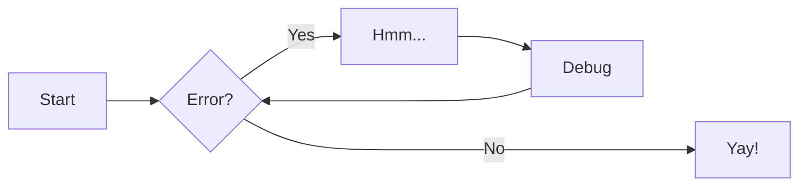
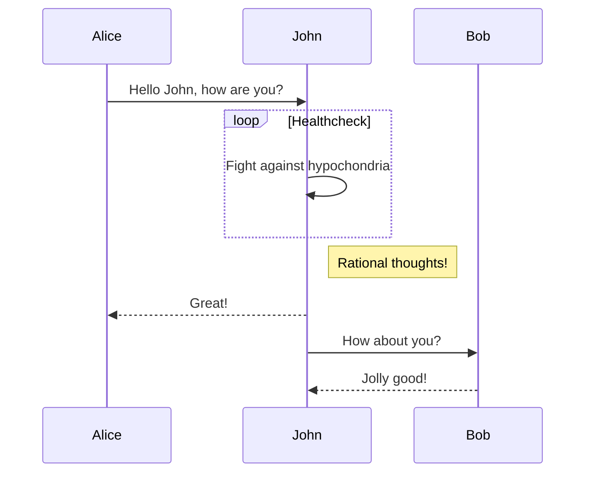
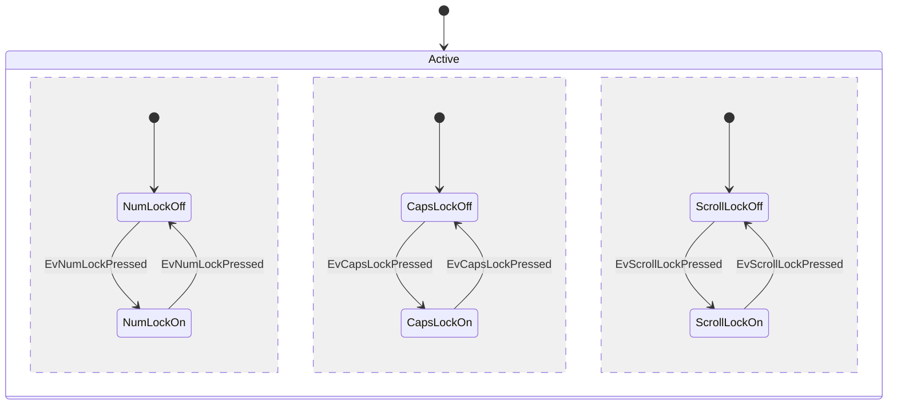
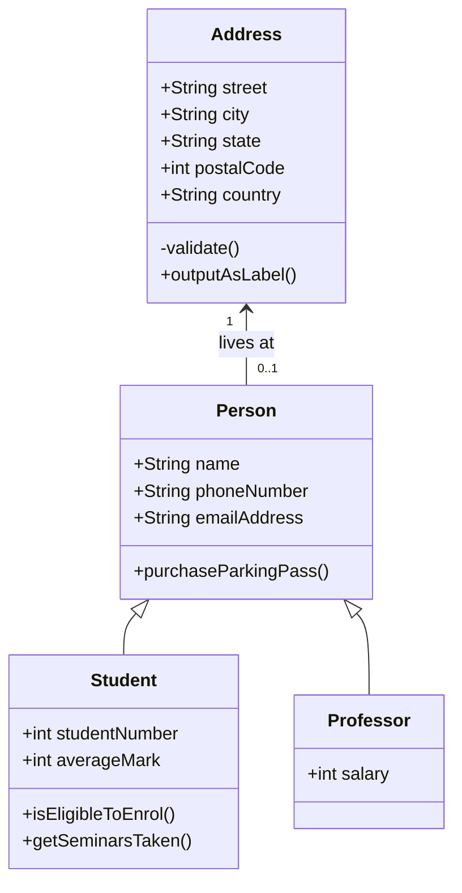
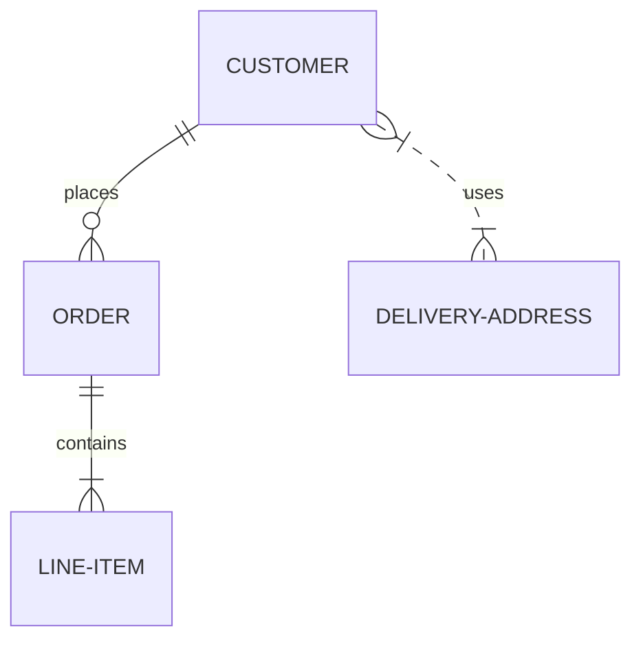
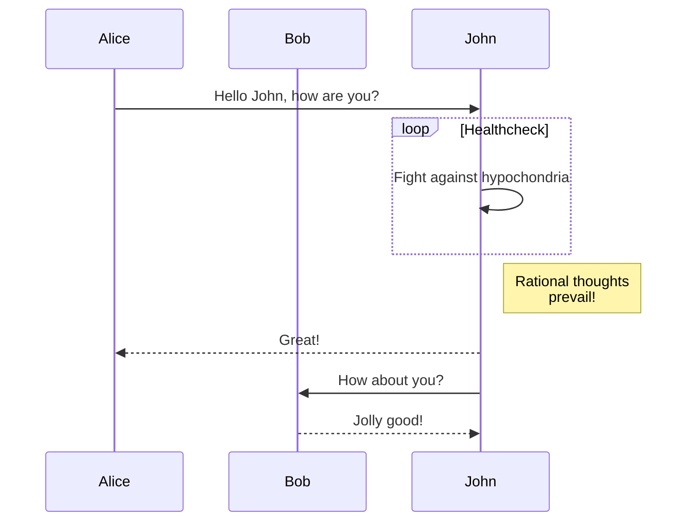
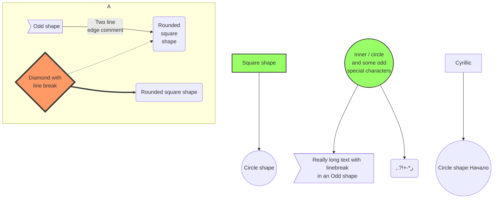

# Data Structures and Algorithms in Python

For full documentation visit [mkdocs.org](https://www.mkdocs.org).

## Project layout

    mkdocs.yml    # The configuration file.
    docs/
        index.md  # The documentation homepage.
        ...       # Other markdown pages, images and other files.

## Reference
::: dsa.algorithms.divide_and_conquer.binary_search


## Details
### Nested
???+ note "Open styled details"

    ??? danger "Nested details!"
        And more content again.

### Normal
??? success
    Content.

??? warning classes
    Content.


## MathJax
$p(x|y) = \frac{p(y|x)p(x)}{p(y)}$, \(p(x|y) = \frac{p(y|x)p(x)}{p(y)}\).

$$
E(\mathbf{v}, \mathbf{h}) = -\sum_{i,j}w_{ij}v_i h_j - \sum_i b_i v_i - \sum_j c_j h_j
$$

\[3 < 4\]

\begin{align}
p(v_i=1|\mathbf{h}) & = \sigma\left(\sum_j w_{ij}h_j + b_i\right) \\
p(h_j=1|\mathbf{v}) & = \sigma\left(\sum_i w_{ij}v_i + c_j\right)
\end{align}

## Superfence
### Flowchart

### Sequence diagrams

### State diagrams

### Class diagrams

### Entity-Relationship diagram



### Large Diagram
* https://mermaid-js.github.io/mermaid/#/examples?id=basic-flowchart


???+ note "Implementation in various languages"

    === "C"
    
        ``` c
        #include <stdio.h>
    
        int main(void) {
          printf("Hello world!\n");
          return 0;
        }
        ```
    
    === "C++"
    
        ``` c++
        #include <iostream>
    
        int main(void) {
          std::cout << "Hello world!" << std::endl;
          return 0;
        }
        ```
    
    === "Python"
    
        ``` python
        def main() -> int:
          print("Hello world!")
          return 0
        ```

``` yaml
theme:
  features:
    - content.code.annotate # (1)
```

1. :man_raising_hand: I'm a code annotation! I can contain `code`, __formatted
    text__, images, ... basically anything that can be expressed in Markdown.
